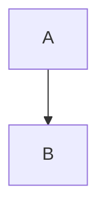
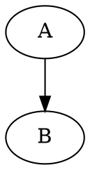

# Pandoc HTML Defaults (with Diagrams)

A minimal, per-project setup for converting **Markdown → HTML** using Pandoc, with first-class support for **Mermaid and other diagrams** via `pandoc-ext-diagram`.

This project intentionally keeps things simple:

* You call `pandoc` yourself
* Input/output files are explicit
* All common flags live in a Pandoc **defaults file**

No wrapper scripts, no CSS, no templates.

---

## Project Structure

```
.
├─ pandoc/
│  └─ html.yaml
│
└─ README.md
```

* `pandoc/html.yaml` — project defaults (acts like an rc file)
* `README.md` — setup and usage instructions

---

## Requirements

* Pandoc **2.19+** (recommended)
* `pandoc-ext-diagram`

---

## Install Pandoc

### Ubuntu / Debian

```bash
sudo apt update
sudo apt install pandoc
```

### macOS (Homebrew)

```bash
brew install pandoc
```

### Verify

```bash
pandoc --version
```

---

## Install pandoc-ext-diagram

`pandoc-ext-diagram` is a Lua filter used to render diagrams such as Mermaid, Graphviz, PlantUML, and others.

### Install (download the Lua filter)

Create a `filters` directory in pandoc's user data directory and download the filter there:

```bash
mkdir -p ~/.pandoc/filters
curl -L https://raw.githubusercontent.com/pandoc-ext/diagram/main/_extensions/diagram/diagram.lua \
  -o ~/.pandoc/filters/pandoc-ext-diagram.lua
```

Verify that pandoc can locate the filter:

```bash
pandoc --list-lua-filters
```

Pandoc will automatically find the filter as long as it is placed in the `filters` subdirectory of the pandoc user data directory (`~/.pandoc/filters/`).

---

## Pandoc Defaults File

### `pandoc/html.yaml`

This file defines the shared defaults for the project.

* Markdown → HTML5
* Diagram rendering via `pandoc-ext-diagram`
* Syntax highlighting for non-diagram code blocks

```yaml
from: markdown+fenced_code_blocks+pipe_tables+task_lists
to: html5

standalone: true

filters:
  - pandoc-ext-diagram.lua

metadata:
  diagram:
    cache: true

syntax-highlighting: true
highlight-style: pygments

toc: true
toc-depth: 3
number-sections: true

html-q-tags: true
wrap: none
```

---

## Usage

Call Pandoc explicitly and reference the defaults file:

```bash
pandoc \
  --defaults pandoc/html.yaml \
  input.md \
  -o output.html
```

You can override any default at runtime:

```bash
pandoc \
  --defaults pandoc/html.yaml \
  --toc-depth=2 \
  input.md \
  -o output.html
```

---

## Writing Markdown

### Mermaid Diagrams

````md

````

### Graphviz / DOT

````md

````

### Regular Code Blocks (Syntax Highlighted)

````md
```python
print("hello")
```
````

Diagram blocks are intercepted by `pandoc-ext-diagram`; all other code blocks use Pandoc's built-in syntax highlighting.

---

## Adding New Defaults

To add another output configuration (for example, slides or PDFs):

1. Create a new defaults file:

   ```bash
   pandoc/slides.yaml
   ```

2. Adjust options as needed

3. Call Pandoc with the new defaults:

   ```bash
   pandoc --defaults pandoc/slides.yaml input.md -o output.html
   ```

Each defaults file is independent and can evolve without affecting others.

---

## Notes

* No CSS or templates are included by design
* No assumptions about hosting or deployment
* Suitable for local use or CI pipelines

---

## License

MIT (or project-specific, if desired)
