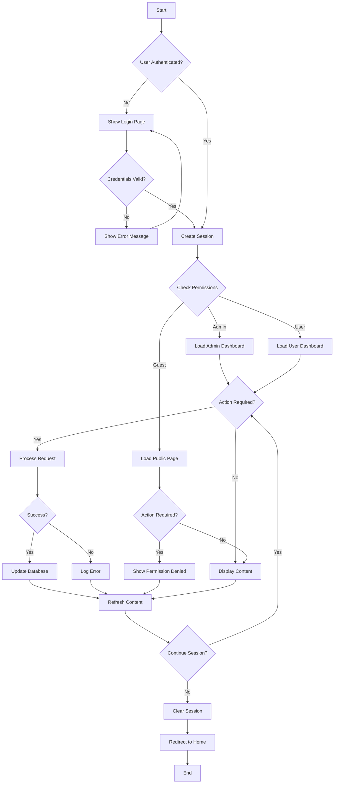
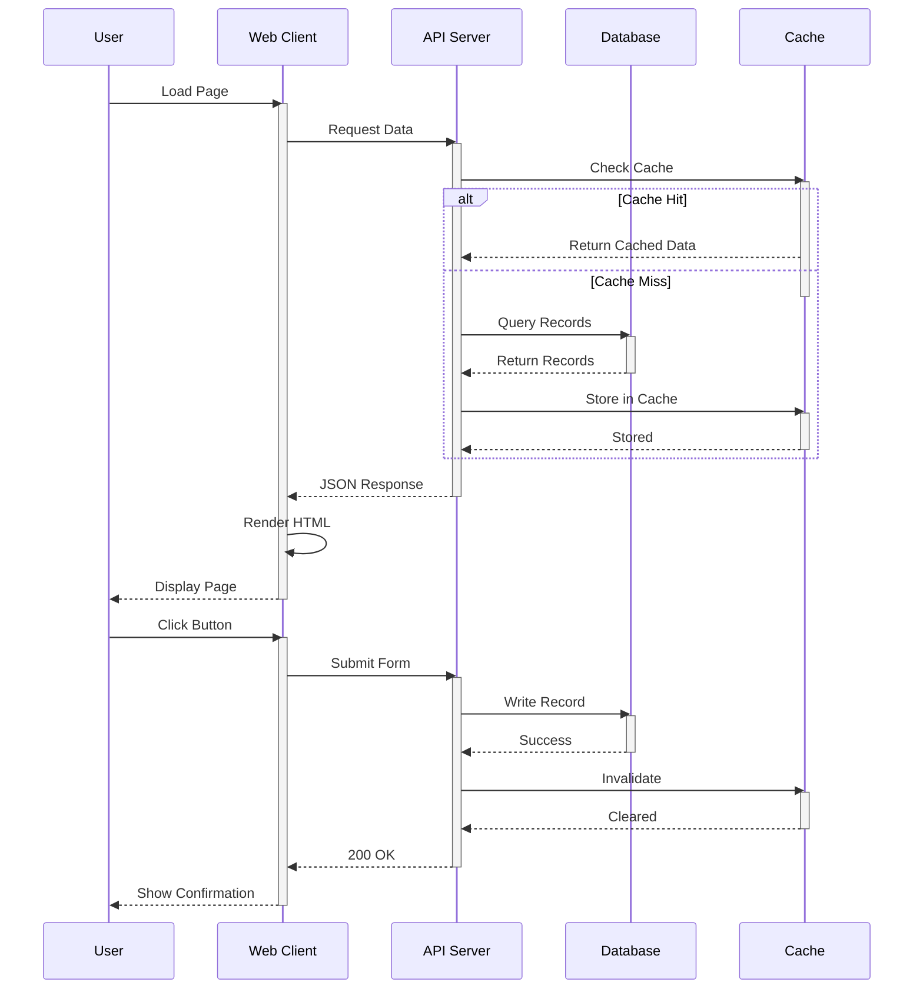

# Comprehensive Test Document

This document collects a wide variety of Markdown features to test the md -> HTML pipeline.

- Purpose: exercise headings, lists, tables, code blocks, diagrams, math, footnotes, images, raw HTML, and more.

## Features

- Headings (levels 1..4)
- Ordered and unordered lists
- Task lists
- Tables
- Code blocks (bash, python)
- Diagram block (handled by pandoc filter)
- Inline and display math
- Footnotes
- Raw HTML

## Headings

### Subheading level 3

#### Subheading level 4

Internal link to the [Code Samples](#code-samples) section.

## Lists

Unordered list:

- Item one
- Item two
  - Nested item

Ordered list:

1. First
2. Second
3. Third

Task list:

- [x] Completed task
- [ ] Incomplete task

## Table

| Name | Type | Notes |
|------|------|-------|
| foo  | str  | simple |
| bar  | int  | numeric |

## Code Samples

Inline code: `printf("hello\n")`

### Bash

```bash {.numberLines}
#!/bin/bash
echo "Hello, md2html-pipeline"
mkdir -p output
cd output
touch test.txt
for file in *.txt; do
  echo "Processing $file"
done
```

### Python

```python {.numberLines}
def fib(n):
    if n < 2:
        return n
    return fib(n-1) + fib(n-2)

class Counter:
    def __init__(self):
        self.count = 0
    
    def increment(self):
        self.count += 1

print(fib(10))
```

### JavaScript (no line numbers)

```javascript
function quickSort(arr) {
  if (arr.length <= 1) return arr;
  const pivot = arr[0];
  const left = arr.slice(1).filter(x => x < pivot);
  const right = arr.slice(1).filter(x => x >= pivot);
  return [...quickSort(left), pivot, ...quickSort(right)];
}

const data = [3, 1, 4, 1, 5, 9, 2, 6];
console.log(quickSort(data));
```

### JSON

```json
{
  "name": "md2html-pipeline",
  "version": "1.0.0",
  "description": "Markdown to HTML with diagrams",
  "author": "Test Suite",
  "dependencies": {
    "pandoc": "^3.0.0",
    "mermaid": "^10.0.0"
  }
}
```

### YAML {.numberLines}

```yaml {.numberLines}
pipeline:
  version: "1.0"
  stages:
    - name: validate
      script: pandoc --version
    - name: convert
      script: pandoc --defaults pandoc/html.yaml input.md
    - name: output
      path: tests/output.html
```

### SQL

```sql
SELECT 
  u.id, 
  u.name, 
  COUNT(o.id) as order_count,
  SUM(o.total) as total_spent
FROM users u
LEFT JOIN orders o ON u.id = o.user_id
WHERE u.created_at > DATE_SUB(NOW(), INTERVAL 30 DAY)
GROUP BY u.id
HAVING COUNT(o.id) > 5
ORDER BY total_spent DESC;
```

## Diagram

Flowchart (complex with multiple steps):



Sequence Diagram (complex):



## Math

Inline math: $a^2 + b^2 = c^2$.

Display math:

$$
\int_0^{\infty} e^{-x} \, dx = 1
$$

## Blockquote

> This is a blockquote. It should be indented and styled by the pipeline.

## Raw HTML

Raw HTML should pass through or be handled correctly:

<kbd>Ctrl</kbd> + <kbd>C</kbd>

## Definition List

Term A
: Definition for term A.

Term B
: Definition for term B; this can be multiple lines and include *markup*.

## Footnote

Here is a sentence with a footnote.[^1]

[^1]: This is the footnote content explaining the sentence above.

---

## Images and Links

Link to an external site: https://example.com

Link to an internal section: [Features](#features)

<!-- End of file -->
